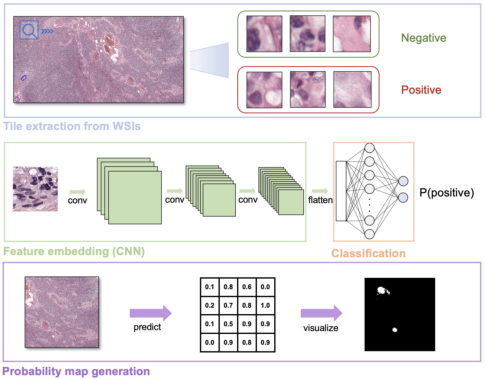
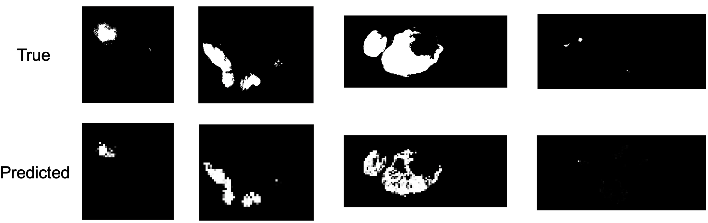

# Breast Cancer Prediction

## Introduction

This project aims to predict the region of breast cancer on lymph node when a whole-slide image (WSI) is given.

### About WSI

WSI is digitallized high-resolution image of a tissue, which can be obtained by scanning glass slide on microscope with dedicated scanner. WSI can be utilized for fast detection of lesion without high cost optical equipments.

WSI contains multiple level of resolutions to acheive rapid retrieval of subregions of the image. When pathologists observes WSI, they annotate the area of lesion by hand.

### Methodology of this project

In this project, we devide WSI into tumor-annotated small tiles (256x256) to accomplish pointwise classification of tumor existence. CNN is applied to represent feature of image, and dense network with softmax activation for predicting possibility of tumor. Finally, all the tiles are collated into WSI, representing probability map of tumor.



## Data description

All the data were taken from CAMELYON16 & CAMELYON17 open dataset. The dataset contains:

- CAMELYON16
  - training set
    - 160 normal images
    - 111 tumorous images and annotations in `xml` format
  - 130 test images
- CAMELYON17
  - training set
    - 450 normal images
    - 50 tumorous images and annotations in `xml` format
  - 500 test images

For data usage, please check `dataset_details.md`. We did not use all the data, because WSIs have very large file sizes. From that reason, real files are not included in this repository. Please check `dataset_details.md` and download data in appropriate directories in order to run this project.

### More details on data preprocessing

- Tile size: 256 x 256 pixels
- Criterion for tumorous tile: over 60% tumor area, 50% overlap with adjacent tiles (to overcome shortage)
- Criterion for normal tile: over 20% tissue area (since some regions are just background)
- Maximum number of tiles per a slide: 1000
- Data augmentation: mirroring, rotation
  
## Model specification

- Input data: 256 x 256 tile images
- Input labels: 0(normal) or 1(tumor)
- CNN layers: `InceptionResNetV2` w/ pretrained weights (`imagenet`)
- Dense layer: 1024 nodes w/ sigmoid activation

## Using code

### Package requirements

-Python

These are also specified in `requirements.txt`

- `python` 3 (≤3.6)
- `scipy==1.3.1`
- `pandas==0.25.3`
- `openslide==3.4.1`
- `tensorflow>=2.0`
- `scikit-learn==0.21.3`
- `scikit-image==0.16.2`
- `graphviz==0.13.2`
- `progress==1.5`

Owing to the large network use in this project, GPU version of tensorflow is highly recommneded.

-Other library

- `libiconv 1.15` (install it with `conda`)

### Tile generation

Move to `preprocess/` and execute following will generate tiles from WSIs in training set in `hdf5` format. At this stage, one file is generated for one slide.

```bash
python generate_tiles.py
```

The files are stored in `data_generated/`. Now, execute follwing to collect all files into a single `hdf5` file. This is to reduce file i/o time.

```bash
python generate_hdf5.py
```

### Train model for tile classification

Move to `cnn_model` and execute following to train and save tile clasifier model.

```bash
python model.py
```

Now the trained model is saved at `data_generated/model_final.hdf5`.

### Prediction: generate tumor probability map

Now move to `heatmap_creation/` and run `heatmap.py`. To select the slides to predict, modify following lines:

```python
mgr = SlideManager(cam16_dir=camelyon16_path) # camelyon 16 was used for only test set

slides = mgr.slides[-6:-3] # therefore, slides only contains test images
                           # modify indices for selection 

for slide in slides:
    heatmap(slide, model)
```

Predicted probability map will be saved as `(slide name)_heatmap_pred.png`. For comparison, true annotation mask will also saved as `(slide name)_heatmap_true.png`.

Example of prediction:


## References & resources

- The package `preprocessing` is adapted from https://gitlab.com/deep.TEACHING/educational-materials.
- Download link for Trained model: [here](https://www.dropbox.com/s/uwvzru7of68mo0o/model_final.hdf5?dl=0)